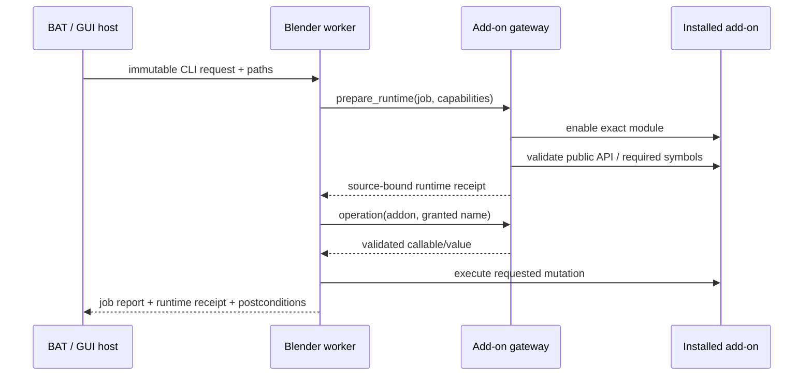

# Blender add-on integration boundary

이 문서는 `SpeedTree_Batch_Tools.bat`에서 시작하는 프로세스와 Blender
애드온 사이의 단일 통합 경계를 정의한다. BAT 파일은 GUI를 여는 얇은
launcher일 뿐이며 애드온 로직을 소유하지 않는다.

## 책임

| 계층 | 소유하는 것 | 금지되는 것 |
|---|---|---|
| BAT / GUI / batch host | 대상 선택, 공용 큐, 프로세스 수명, timeout/retry, 요청·receipt 보존 | 애드온 내부 모듈 import, Blender scene 변경, 애드온 버전 추측 |
| `blender_addon_gateway` | 애드온 활성화, capability 협상, 허용된 operation 해석, 실제 module 경로·해시 receipt | 생산 대상을 고르거나 job을 재시도하는 것 |
| Blender add-on | Blender datablock/scene 변경과 애드온 고유 SpeedTree·Unreal 의미론, postcondition | batch queue 변경, 요청에 없는 대상으로 범위 확대 |

이 책임표의 machine-readable 원본은 `blender_addon_contract.py`의
`OWNERSHIP`과 `ADDONS`이다. 새 worker가 외부 애드온을 직접 import하거나
`addon_utils.enable()`을 호출하면 `tests/test_blender_addon_boundary.py`가
실패한다.

## 실행 흐름

중요한 규칙은 capability와 모든 operation이 **첫 mutation 전에** 확인된다는
점이다. 일부 파일을 수정한 뒤 필요한 함수가 없음을 발견하는 partial-upgrade
실패를 허용하지 않는다.

## 현재 capability 경계

- `speedtree_bone_weight_repair`
  - SPM SK preflight
  - SpeedTree export
  - Blender repair pipeline
  - material handoff
  - exact Atlas manifest consumer hook
- `atlas_leaf_mesh_builder`
  - scene generation settings
  - target registry
  - saved Blender source index
  - SpeedTree target publication
  - atomic exact-target transaction (native public API v1)
- `send2ue`
  - headless disk export
  - Unreal RPC
  - FBX exporter
- `speedtree_cluster_normalizer`
  - Cluster normalization registration
- `ue_unique_export_names_addon`
  - Unreal handoff JSON refresh

Atlas는 자체 `integration_api.py`의 native capability까지 협상한다. 아직 native
API가 없는 애드온은 gateway adapter가 명시적인 symbol allowlist를 검증한다.
따라서 내부 경로 변경은 job 중간의 임의 `ImportError`가 아니라 startup contract
failure로 보고된다.

## source identity와 junction

각 runtime receipt에는 다음 정보가 들어간다.

- Blender가 실제 load한 `module_file`과 source root
- add-on version
- `__init__.py` SHA-256
- 협상된 capability와 native API contract
- gateway 파일 SHA-256, request SHA-256, process ID

`SPEEDTREE_BWR_ADDON_DIR`, `SPEEDTREE_ATLAS_ADDON_DIR`,
`SPEEDTREE_SEND2UE_ADDON_DIR`,
`SPEEDTREE_CLUSTER_NORMALIZER_ADDON_DIR`,
`SPEEDTREE_UNIQUE_EXPORT_NAMES_ADDON_DIR` 중 하나가 지정되면 실제 load 경로가
그 source 밖에 있을 때 mutation 전에 실패한다.

BWR preset의 기본 위치도 더 이상 `Documents/GitHub` checkout을 추측하지
않는다. Blender 5.2 `scripts/addons`에 설치된 junction만 resolve해 Blender가
실제로 실행하는 BWR source와 같은 checkout을 사용한다. 5.1 설치본으로는
fallback하지 않는다.

## 새 연동을 추가하는 방법

1. `blender_addon_contract.ADDONS`에 capability와 operation allowlist를 추가한다.
2. 가능하면 애드온 자체 public `integration_api.py`에 version/capability handshake를
   제공한다.
3. worker는 `prepare_runtime()`으로 필요한 capability만 요청한다.
4. worker report에 `session.receipt`을 보존한다.
5. direct-import boundary test와 request/receipt unit test를 추가한다.
6. Blender `--factory-startup --background` smoke test로 실제 junction 설치본을
   검증한다.

애드온 내부 함수가 바뀌었을 때 worker 파일을 함께 수정하는 방식은 지원하지
않는다. native API 또는 gateway operation contract를 version-up하고 consumer가
새 capability를 명시적으로 요구해야 한다.
